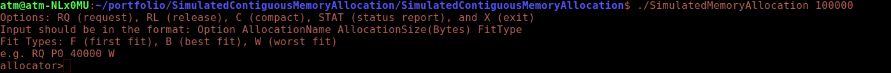

[Back to Portfolio](./)

Simulated Contiguous Memory Allocation
===============

-   **Class:** Operating Systems
-   **Grade:** 100/100 Pending confirmation
-   **Language(s):** C
-   **Source Code Repository:** [ATM2100/Hangman](https://github.com/ATM2100/Hangman?tab=readme-ov-file)  
    (Please [email me](mailto:atmacklin@csustudent.net?subject=GitHub%20Access) to request access.)

## Project description

This simulated memory allocation program implements a doubly linked list so that memory of a given size can have information allocated to, removed from, condensed and shown the status of. Insert will allow the user to request memory of a size and either Best, Worst or First fit and give a kind of PID. Remove takes a PID and removes it from the simulated memory. Condense makes all of the running processes contiguous. Status shows the current processes in memory and where the gaps are.

## How to compile and run the program

All that is needed to compile and run the project is to be in the correct directory and run make. The number in the third commannd that actually runs the project can be any number, but I recomend it be at least 100 times bigger than the ammount you request at a time.

```
cd ./SimulatedContiguousMemoryAllocation
make
./SimulatedMemoryAllocation 100000
```

## UI Design

This program provides a custom terminal interface that can recieve five commands that allow for interfacing with the simulated memory. Please note that the program does not check for human error at all because this is supposed to simulate a computer allocating memory. As such, the algorithms that determain things like names and which process to delete when are assumed to be correct. 

A Refrence for the five commands available is printed at the start of the output (see Fig 1), as well as the types of fits available to request for. To request a block of memory, the provided example is a good place to start. After that, Requesting is done in this format:
```
RQ [name of process] [size] [fit type]
```
The three types of fits are in the refrence, and an example of a request can be seen in (Fig 2 and 6). The built in method of showing how the memory is allocated is the command:
```
STAT
```
which will give an output to the terminal (see Fig 3). Release is given the format of:
```
RL [name of Process]
```
Release removes the process specified (see Fig 4) and makes that section of memory "Unused". For Examples of the other two kinds of fits see (Fig 5). For the two remaining commands, just the single letters in the refrence are required.

Compact:
```
C
```

Exit Program:
```
X
```

  
Fig 1. When run initially

  
Fig 2. Example of requesting memory.

  
Fig 3. Shows the current status of the memory.

    
Fig 4. Releasing memory example.

    
Fig 5. Worst and Best Fit examples.

    
Fig 4. Compaction example.

[Back to Portfolio](./)